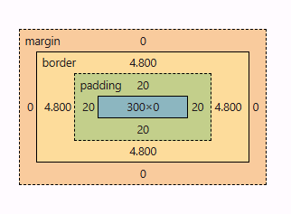
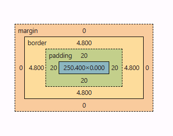
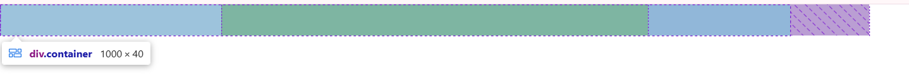
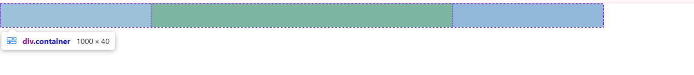
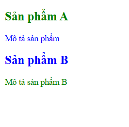

## PHẦN A — KIỂM TRA ĐỌC HIỂU (25 điểm)

### Câu A1 (5đ) — 3 Cách nhúng CSS

Inline:

```
- VD: <h1 style="font-size: 32px;">Tiêu đề</h1>
- Ưu điểm:
      - Áp dụng ngay lập tức, không cần file riêng
      - Độ ưu tiên cao nhất (chỉ sau !important)
      - Hữu ích khi debug, override tạm thời
- Nhược điểm:
      - Khó tái sử dụng, khó bảo trì
      - Trộn lẫn HTML và CSS, làm code rối, khó đọc
      - Mỗi lần load trang là phải load luôn inline css
- Khi nào nên dùng: Chỉ dùng khi khẩn cấp / override tạm thời
```

Internal:

```
- VD:
'''html
<head>
    <style>
        body{font-family: sans-serif}
    </style>
</head>
'''
- Ưu điểm:
      - Có thể quản lý cùng lúc nhiều element trong 1 trang
- Nhược điểm:
      - Không thể tái sử dụng ở trang khác
      - Vẫn phải tốn thời gian load css mỗi khi load trang
- Khi nào nên dùng: Khi làm prototype hoặc trang đơn.
```

External:

```
- VD:
'''html
<head>
  <link rel="stylesheet" href="styles.css" />
</head>
'''
'''css
/* styles.css */
body {
  font-family: sans-serif;
}
'''
- Ưu điểm:
      - Tái sử dụng trên nhiều trang HTML, cực kỳ phù hợp khi làm trên nhiều file html
      - Dễ bảo trì do tách biệt HTML và CSS
      - Về mặt caching: Browser cache được file CSS, từ lần sau không cần tải lại CSS nữa
- Nhược điểm:
      - Cần nhớ nơi đặt file CSS
- Khi nào nên dùng: Dùng cho mọi dự án thật
```

```
**Câu hỏi thêm:** Nếu cùng 1 element có cả 3 cách CSS đồng thời áp dụng, cách nào "thắng"? Giải thích tại sao.
- Nếu không xét trường hợp sử dụng !important. Inline sẽ thắng vì nó có độ ưu tiên cao nhất trong cả 3 cách.
```

### Câu A2 (8đ) — CSS Selectors — Dự đoán kết quả

Cho HTML sau:

```html
<div id="app">
  <header class="top-bar dark">
    <h1>ShopTLU</h1>
    <nav>
      <a href="/" class="active">Home</a>
      <a href="/products">Products</a>
      <a href="/about">About</a>
    </nav>
  </header>
  <main>
    <article class="product">
      <h2>iPhone 16</h2>
      <p class="price">25.990.000đ</p>
      <p>Mô tả sản phẩm...</p>
    </article>
    <article class="product featured">
      <h2>MacBook Pro</h2>
      <p class="price">45.990.000đ</p>
      <p>Mô tả sản phẩm...</p>
    </article>
  </main>
</div>
```

**Không chạy code**, cho biết mỗi selector sau chọn được element nào? (Ghi cụ thể text content)

```css
1. h1
→ Chọn: <h1>ShopTLU</h1>
2. .price
→ Chọn: <p class="price">25.990.000đ</p>; <p class="price">45.990.000đ</p>
3. #app header
→ Chọn:
'''
<header class="top-bar dark">
        <h1>ShopTLU</h1>
        <nav>
            <a href="/" class="active">Home</a>
            <a href="/products">Products</a>
            <a href="/about">About</a>
        </nav>
    </header>
'''
4. nav a:first-child
→ Chọn: <a href="/" class="active">Home</a>
5. .product.featured h2
→ Chọn: <h2>MacBook Pro</h2>
6. article > p
→ Chọn: <p class="price">25.990.000đ</p>; <p>Mô tả sản phẩm...</p>; <p class="price">45.990.000đ</p>; <p>Mô tả sản phẩm...</p>
7. a[href="/"]
→ Chọn: <a href="/" class="active">Home</a>
8. .top-bar.dark h1
→ Chọn: <h1>ShopTLU</h1>
```


### Câu A3 (7đ) — Box Model — Tính toán kích thước

Đọc chương 11 (Box Model). Tính **kích thước thực tế** (chiều rộng thực tế render trên browser) cho mỗi trường hợp sau:

```css
/* Trường hợp 1: content-box (mặc định) */
.box-1 {
    width: 400px;
    padding: 20px;
    border: 5px solid black;
    margin: 10px;
}
→ Chiều rộng hiển thị = 400 + 20*2 + 5*2 = 450px
→ Không gian chiếm trên trang = 450 + 10*2 = 570px

/* Trường hợp 2: border-box */
.box-2 {
    box-sizing: border-box;
    width: 400px;
    padding: 20px;
    border: 5px solid black;
    margin: 10px;
}
→ Chiều rộng hiển thị = 400px
→ Kích thước content thực tế = 400 - 20*2 - 5*2 = 350px
→ Không gian chiếm trên trang = 400 + 10*2 = 470px

/* Trường hợp 3: Margin collapse */
.box-a { margin-bottom: 25px; }
.box-b { margin-top: 40px; }
→ Khoảng cách giữa box-a và box-b = max(25,40) = 40px
→ Giải thích tại sao KHÔNG PHẢI 65px: Vì đây là margin collapse, nên margin dọc giữa 2 block sẽ gộp lại.
```

**Nâng cao:** Nếu `.box-a` có `margin-bottom: -10px` và `.box-b` có `margin-top: 40px`, khoảng cách = 30. Vì box-a có margin-bottom âm nên box-b được kéo lên

### Câu A4 (5đ) — Specificity (Độ ưu tiên)

Cho các CSS rules sau cùng target 1 element `<p class="price" id="main-price">`:

```css
p {
  color: black;
} /* Rule A */
.price {
  color: blue;
} /* Rule B */
#main-price {
  color: red;
} /* Rule C */
p.price {
  color: green;
} /* Rule D */
```

1. Tính specificity score (a, b, c) cho mỗi rule
   | Selector | A(ID #) | B(Class .) | C(Tag) | Tổng |
   |---|---|---|---|---|
   | Rule A| 0 | 0 | 1 | 1 |
   | Rule B | 0 | 1 | 0 | 10 |
   | Rule C | 1 | 0 | 0 | 100 |
   | Rule D | 0 | 1 | 1 | 11 |
2. Element sẽ có màu `red`, vì Rule C có điểm specificity cao nhất (100)
3. Nếu thêm `<p class="price" id="main-price" style="color: orange;">`, element sẽ có màu `orange`, vì thẻ <p> đang sử dụng nhúng CSS Inline có 1000+ điểm specificity
4. Nếu Rule A thêm `!important`, element có màu `black`, vì !important giúp Rule A có vô hạn diểm specificity

## PHẦN B — THỰC HÀNH CODE (55 điểm)

### Bài B2 (20đ) — Box Model Lab

**Phần 1 — Chứng minh content-box vs border-box (10đ):**  
Hộp 1  
  
Hộp 2  
  
Hộp 1 (content-box): chiều rộng thực tế = 349.6 px (đo từ DevTools)  
Hộp 2 (border-box): chiều rộng thực tế = 300 px (đo từ DevTools)  
Giải thích:

- Với content-box, width chỉ apply cho content area => Padding và border "phình ra ngoài" khi thêm vào => width thực tế thay đổi
- Với border-box, width sẽ bao gồm từ border vào trong (border,padding,content) => thêm padding,border thì content bé lại => width thực tế không đổi

**Phần 2 — Layout 3 cột (10đ):**  
Content-box  
  
Border-box  


### Bài B3 (15đ) — Specificity Battle

| Selector                                | Specificity |
| --------------------------------------- | ----------- |
| p{ color: aqua;}                        | 0,0,1       |
| body p { color: red;}                   | 0,0,2       |
| .text { color: lightblue;}              | 0,1,0       |
| p.text { color: black;}                 | 0,1,1       |
| .text.highlight { color: blue;}         | 0,2,0       |
| p.text.highlight { color: yellowgreen}  | 0,2,1       |
| p.highlight.text { color: darkgreen}    | 0,2,1       |
| #demo { color: orange}                  | 1,0,0       |
| #demo.text { color: mediumspringgreen}  | 1,1,0       |
| #demo.highlight { color: darkgoldenrod} | 1,1,0       |

1. Liệt kê (Bảng trên)
2. Element cuối cùng hiển thị màu darkgoldenrod. Tại vì #demo.highlight có điểm Specificity là 1,1,0 là số điểm cao nhât trong các selector (cùng với #demo.text) và #demo.highlight được viết sau #demo.text, nếu có cùng điểm specificity thì selector nào viết sau sẽ thắng.
3. 
4. Nếu để #demo.text được viết sau #demo.highlight thì element sẽ hiển thị màu mediumspringgreen. Vì #demo.highlight và #demo.text đều có điểm specificity cao nhất nhưng vì #demo.text được viết sau nên thắng

## PHẦN C — DEBUG & SUY LUẬN (20 điểm)

### Câu C1 (10đ) — Debug CSS Layout

1. Tính chiều rộng **thực tế** của sidebar và content (content-box!)  
   sidebar: 300 + 20*2 + 2 = 342px
   content: 660 + 30*2 + 2 = 722px
2. Giải thích tại sao layout bị vỡ: bởi vì tổng chiều rộng thực tế của sidebar và content lớn hơn chiều rộng của container.
3. Đưa ra **2 cách sửa** khác nhau (1 cách dùng border-box, 1 cách không dùng) (xem trong `debug_layout.css`)
4. Tạo file `debug_layout.html` + `debug_layout.css` chứng minh cả 2 cách sửa hoạt động: Cả hai cách đều cho kết quả đều cho thấy sidebar và content đều nằm cùng hàng và width đo được của cẩ hai ở cả hai trường hợp đều là 960px

### Câu C2 (10đ) — Cascade Puzzle

1. "Sản phẩm A" (h2) có `font-size` = 20px vì .card .title { font-size: 20px; } có ưu tiên các nhất trong các selector trỏ tới và `color` = `green` vì "Sản phẩm A" có class `highlight` có `color` dùng `!important`

| Selector                                | Specificity |
| --------------------------------------- | ----------- |
| body { font-size: 16px; color: #333; }  | 0,0,1       |
| .container { font-size: 14px; }         | 0,1,0       |
| .card { color: blue; }                  | 0,1,0       |
| .card .title { font-size: 20px; }       | 0,2,0       |
| #featured .title { color: red; }        | 1,1,0       |
| .highlight { color: green !important; } | ♾️,1,0      |

2. "Mô tả sản phẩm" (p trong card featured) có `color` = `blue` vì .card p { color: inherit; } có ưu tiên các nhất trong các selector trỏ tới nên color sẽ được thừa hưởng từ cha là .card mà .card { color: blue; }

| Selector                               | Specificity |
| -------------------------------------- | ----------- |
| body { font-size: 16px; color: #333; } | 0,0,1       |
| .container { font-size: 14px; }        | 0,1,0       |
| .card { color: blue; }                 | 0,1,0       |
| .card p { color: inherit; }            | 0,1,1       |

3. "Sản phẩm B" (h2) có `font-size` = `20px` vì .card .title { font-size: 20px; } có ưu tiên các nhất trong các selector trỏ tới và `color` = `blue` vì .card { color: blue; } là cha của "Sản phẩm 2" mà "Sản phẩm 2" không có định nghĩa về color nên sẽ kế thừa từ cha theo mặc định.

| Selector                               | Specificity |
| -------------------------------------- | ----------- |
| body { font-size: 16px; color: #333; } | 0,0,1       |
| .container { font-size: 14px; }        | 0,1,0       |
| .card { color: blue; }                 | 0,1,0       |
| .card .title { font-size: 20px; }      | 0,2,0       |

4. "Mô tả sản phẩm B" (p.highlight) có `color` = `green` vì có class `highlight` có `color` dùng `!important`

| Selector                                | Specificity |
| --------------------------------------- | ----------- |
| body { font-size: 16px; color: #333; }  | 0,0,1       |
| .container { font-size: 14px; }         | 0,1,0       |
| .card { color: blue; }                  | 0,1,0       |
| .card p { color: inherit; }             | 0,1,1       |
| .highlight { color: green !important; } | ♾️,1,0      |

file: CascadePuzzle.html và CascadePuzzle.css  
Screenshot:  


---

## 🎬 PHẦN D — VIDEO THỰC HÀNH OBS (25 điểm)

link: https://youtu.be/h4nD_-bs8gE
